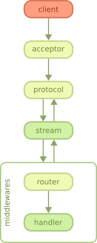

# 执行流程

Cowboy是一个轻量级的HTTP服务器，支持HTTP/1.1，HTTP/2和Websocket。

它建立在Ranch之上。 有关如何处理网络连接的详细信息，请参阅Ranch指南。

## 概况

如图所示，客户端首先连接到服务器。此步骤由Ranch接受器处理，该接受器是专用于处理新连接。

在Ranch接受新连接后，无论是HTTP/1.1还是HTTP/2连接，Cowboy都会开始接收请求并处理它们。

在HTTP/1.1中，所有请求都是顺序进行的。在HTTP/2中，请求可以到达并同时处理。

当请求进入时，Cowboy会创建一个stream，这是一组request/response以及与之关联的所有事件。 Cowboy中的协议代码将这些stream的处理推迟到stream处理程序模块。配置Cowboy时，您可以定义一个或多个模块，它将接收与stream关联的所有事件包括request， response， bodies，Erlang消息等。

默认情况下，Cowboy配置了一个名为cowboy_stream_h的stream处理程序。该stream处理程序将为每个进入的请求创建一个新进程，然后与此进程通信以读取正文或返回响应。请求进程执行中间件，默认情况下包括路由器，然后执行处理程序。与stream处理程序一样，中间件也可以定制。

可以在该图中的几乎任何点返回响应。如果必须在初始化流之前返回响应（例如，因为早期发生了错误），则stream处理程序会收到指示此错误的特殊事件。

## 特定协议header

Cowboy会处理特定于协议的header，并阻止您手动发送它们。 对于HTTP/1.1，包括transfer-encoding 和 connection header。 对于HTTP/2，包括冒号header，如 :status。

在将请求传递给stream处理程序之前，Cowboy还会从请求中删除特定于协议的header。 cowboy试图尽可能地隐藏所有协议的实现细节。

## 每个连接的进程数

默认情况下，Cowboy每个连接使用一个进程，每组请求/响应加一个进程（内部称为stream）。

它为每个请求创建一个新进程的原因是由于HTTP/2的要求，其中请求同时并独立于连接执行。来自不同请求的帧最终在单个TCP连接上交织。

请求流程永远不会被重用。因此，在返回响应之后不需要执行任何清理。该进程将终止，Erlang/OTP将立即回收所有内存。

cowboy 每个连接不需要多个进程。可以直接让stream处理程序（cowboy的底层接口）与连接进行交互。它们在连接过程中执行，可以处理传入的请求并返回响应。但是，在正常情况下不建议这样做，因为执行时间过长的stream处理程序可能会对并发请求或连接本身的状态产生负面影响。

## Date header

因为查询当前日期和时间可能很昂贵，所以Cowboy每秒生成一个Date标头值，将其共享给所有其他进程，然后只需将其复制到响应中。 这允许符合HTTP/1.1而没有实际的性能损失。

## 二进制

Cowboy大量使用二进制文件。

二进制文件比表示字符串的列表更有效，因为它们占用的内存空间更少。 处理性能可根据操作而变化。 如果代码是本地编译的，那么二进制文件通常会得到很大的提升。 有关更多详细信息，请参阅HiPE文档。

二进制文件可能最终在进程之间共享。 当一个进程永远保留二进制数据而不释放它时，这可能导致一些大的内存使用。 如果您在应用程序中看到一些奇怪的内存使用情况，这可能就是原因。

