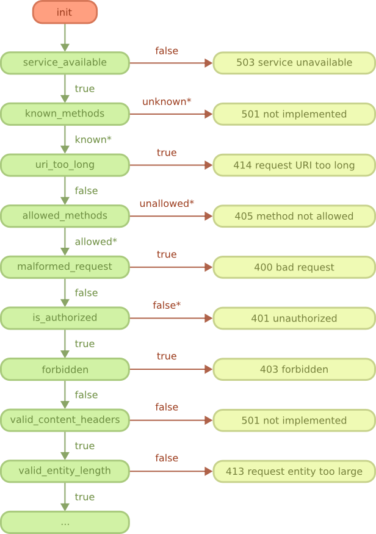
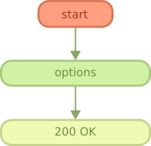
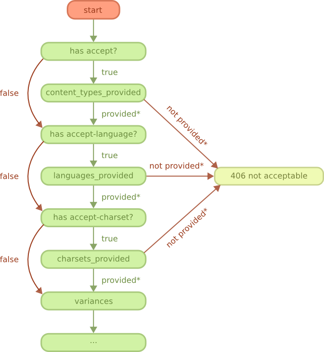
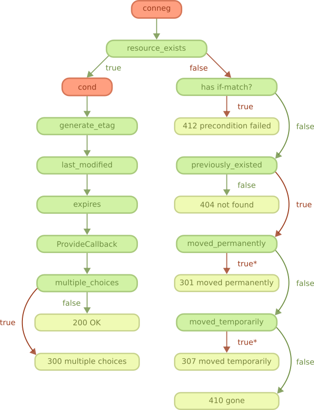
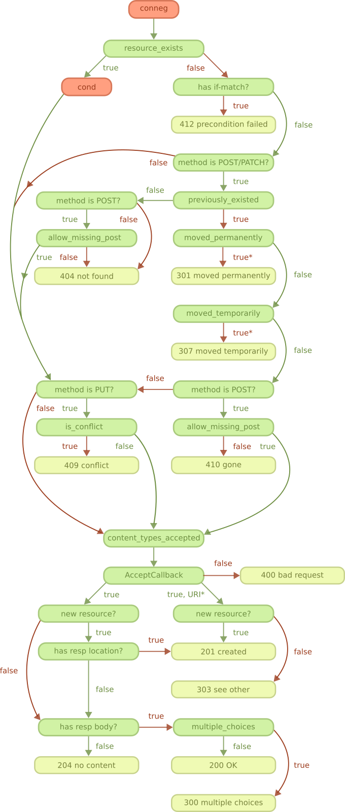
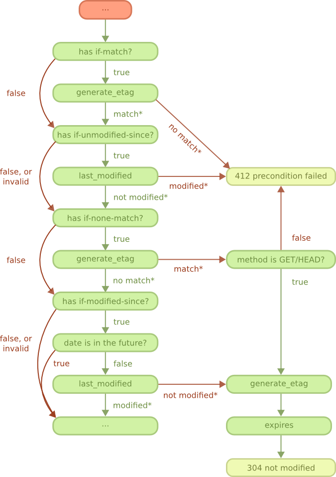

# REST 执行流程

本章将通过许多不同的图解释REST处理程序状态机。

请求可能遵循四种主要路径。 OPTIONS方法之一; 一个用于GET和HEAD方法; 一个用于方法PUT，POST和PATCH; 和一个方法DELETE。

所有路径都以“Start”图开始，除了OPTIONS路径之外的所有路径都通过“Content negotiation”图和可选的“Conditional requests”图（如果资源存在）。

红色方块表示另一个图表。 浅绿色方块表示响应。 其他方块可以是回调或Cowboy自己回答的问题。 如果回调未定义，则绿色箭头表示默认行为。

## Start

所有的请求从这里开始

连续调用一系列回调以执行服务，请求行和请求header的一般检查。

对于任何这些步骤，预计不会收到请求正文（如果有）。 只有在满足所有条件时，才会在“PUT，POST和PATCH方法”图的末尾处理它。

known_methods和allowed_methods回调返回方法列表。 牛仔然后检查请求方法是否在列表中，否则停止。

is_ authorized回调可用于检查对资源的访问是否被授权。 也可以根据需要执行认证。 授权被拒绝时，回调的返回值必须包含适用于所请求资源的质询，该质询将通过www-authenticate标头发送回客户端。

当请求方法是OPTIONS时，该图紧接着是“OPTIONS方法”图，否则紧接着是“内容协商”图。

## OPTIONS method

此图仅适用于OPTIONS请求。

选项回调可用于添加有关资源的信息，例如提供的媒体类型或语言; 允许的方法; 任何额外的信息。 也可以设置响应主体，但不应期望客户端读取它。

如果未定义选项回调，Cowboy将默认发送包含允许方法列表的响应。

## 内容协商

此图适用于除OPTIONS之外的所有请求方法。 它在“Start”图表完成后立即执行。

这些步骤的目的是确定要发送回客户端的适当表示。

请求可以包含任何接受标头;接受accept-language header;或者accept-charset header。如果存在，Cowboy将解析header，然后调用相应的回调以获取此资源提供的内容类型，语言或字符集的列表。然后根据请求自动选择最佳匹配。

如果未定义回调，Cowboy将选择客户端喜欢的内容类型，语言或字符集。

content_types_provided还为它接受的每个内容类型返回回调的名称。只有满足所有条件时，才会在“GET和HEAD方法”图的末尾调用此回调。

选定的内容类型，语言和字符集在Req对象中保存为元值。如果手动设置响应主体（例如，错误代码旁边），则应使用适当的表示。

该图紧接着是“GET和HEAD方法”图，“PUT，POST和PATCH方法”图，或“DELETE方法”图，具体取决于方法。

## GET 和 HEAD 方法

此图仅适用于GET和HEAD请求。

有关cond步骤的说明，请参阅“条件请求”图。

当资源存在且条件步骤成功时，可以检索资源。

Cowboy 通过首先检索有关表示的元数据，然后通过调用 ProvideResource 回调来准备响应。 这是您为从content_types_provided返回的每个内容类型定义的回调。 此回调将返回将被发送回客户端的正文，或者如果必须对正文进行流处理则返回一个有趣的回调。

当资源不存在时，Cowboy将确定资源是否先前存在，如果存在，是否将其移动到其他位置以将客户端重定向到新URI。

如果移动了，则 move_permanently 和 moved_temporarily 回调必须返回资源的新位置。

## PUT, POST 和 PATCH 方法

此图仅适用于PUT，POST和PATCH请求。

有关cond步骤的说明，请参阅“条件请求”图。

当资源存在时，首先执行条件步骤。当成功，并且方法是PUT时，Cowboy将调用is_conflict回调。通过锁定资源，此功能可用于防止潜在的竞争条件。

然后，所有三种方法都会达到我们将在几段中描述的content_types_accepted步骤。

当资源不存在且方法为PUT时，Cowboy将检查冲突，然后继续执行content_types_accepted步骤。对于其他方法，Cowboy将确定资源是否先前存在，如果存在，是否将其移至其他地方。如果资源确实不存在，则该方法为POST，并且对allow_missing_post的调用返回true，然后Cowboy将继续执行content_types_accepted步骤。否则请求处理在那里结束。

如果移动了，则move_permanently和moved_temporarily回调必须返回资源的新位置。

content_types_accepted返回它接受的内容类型列表，但也返回每个内容类型的回调名称。Cowboy将选择适当的回调来处理请求正文并调用它。

此回调可能会返回三个不同返回值之一。

如果在处理请求正文时发生错误，则必须返回false并且Cowboy将发送相应的错误响应。

如果方法是POST，那么您可以使用URI创建资源的地址返回true。这对于编写集合的处理程序特别有用。

否则，返回true表示成功。Cowboy将根据资源是否已创建而不是修改来选择要发送的相应响应，以及响应中位置标头或正文的可用性。

## Delete 方法

此图仅适用于DELETE请求。

有关cond步骤的说明，请参阅“条件请求”图。

当资源存在且条件步骤成功时，可以删除资源。

删除资源是一个两步过程。首先执行回调delete_resource。使用此回调删除资源。

由于资源可能已缓存，因此还必须删除系统中此资源的所有缓存表示。此操作可能需要一段时间，因此您可以在完成之前返回。

Cowboy然后将调用delete_completed回调。如果您知道资源已从系统中完全删除（包括缓存），则可以返回true。如果有任何疑问持续存在，则返回false。Cowboy默认假设为真。

要完成，Cowboy会检查你是否设置了一个响应主体，并根据它发送相应的响应。

当资源不存在时，Cowboy将确定资源是否先前存在，如果存在，是否将其移动到其他位置以将客户端重定向到新URI。

如果移动了，则move_permanently和moved_temporarily回调必须返回资源的新位置。

## 条件请求

此图适用于除OPTIONS之外的所有请求方法。 当资源存在时，它在resource_exists回调之后立即执行。

当请求包含if-match标头中的任何一个时，请求变为有条件的; if-unmodified-since标题; if-none-match标头; 或if-modified-since标头。

如果条件失败，则请求立即结束，而不检索或修改资源。

根据需要调用generate_etag和last_modified。 Cowboy只会调用他们一次然后缓存结果以供后续使用。